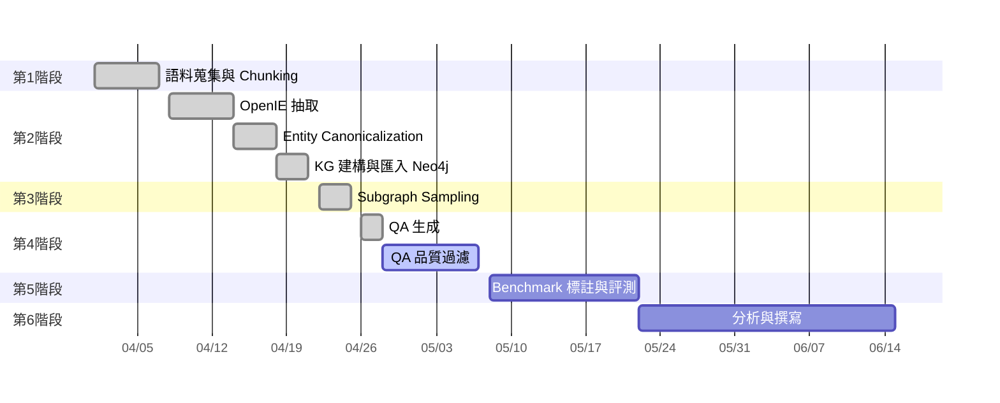

# 論文進度報告

**研究題目：** 以知識圖譜為基礎之 Multi-hop 問答 Benchmark 建構 
**資料來源：** 臺灣博碩士論文知識加值系統（NDLTD）2019–2023

---

## 一、本週完成事項

本週完成從語料前處理到 QA 生成的完整 pilot pipeline，主要成果如下：

**1. KG 建構完成** 使用 OpenAI GPT-4o 對 28,407 篇論文摘要執行 OpenIE 抽取，成功率 99.9%，共產出 356,838 條 triple，並匯入 Neo4j 建立知識圖譜（376,674 個 entity 節點、355,263 條 relation 邊）。每條 relation 均保留 `source_chunks` provenance，可回溯至原始摘要。

**2. Supporting Subgraph Sampling 完成** 從 KG 中依學門分層抽取五種 topology 的 supporting subgraph，共 468 個，涵蓋全部 23 個學門，且全部為 cross-chunk（跨論文）結構。

**3. QA 生成完成** 依據 468 個 subgraph 自動生成對應問答題，成功率 100%，執行時間約 33 秒。

**4. QA 品質過濾進行中** 目前正在調整過濾規則，過濾邏輯已歷經三個版本的修正，預計本週完成。

---

## 二、目前整體進度

---

## 三、關鍵數據摘要

| 項目                    | 數值                     |
| --------------------- | ---------------------- |
| Pilot 資料規模            | 28,407 篇（一年份）          |
| 全部資料規模                | 約 156,000 篇（五年份）       |
| 抽取 triple 數           | 356,838 條              |
| KG entity 節點數         | 376,674 個              |
| Cross-chunk 2-hop 路徑數 | 2,095,600 條            |
| Subgraph 數量           | 468 個（涵蓋 5 種 topology） |
| 生成 QA 題數              | 468 題                  |
| 學門覆蓋                  | 27 個學門                 |

---

## 四、目前卡關的問題

**問題：QA 品質過濾保留率偏低（目前 22%）**

原因是「shortcut 偵測規則」設計有誤，對 constraint topology 造成系統性誤判——constraint 型題目的答案實體本來就出現在摘要中，但並不代表可以不經多跳推理直接回答。目前正在將主觀的 LLM 判斷改為客觀的結構性指標（「單一 chunk 是否同時包含答案與所有條件」），預計修正後保留率可提升至 60% 以上。

---

## 五、下一步計畫

1. **本週內**：完成 QA 過濾規則修正，確認 pilot 保留率達標
2. **下週**：研究評估方法