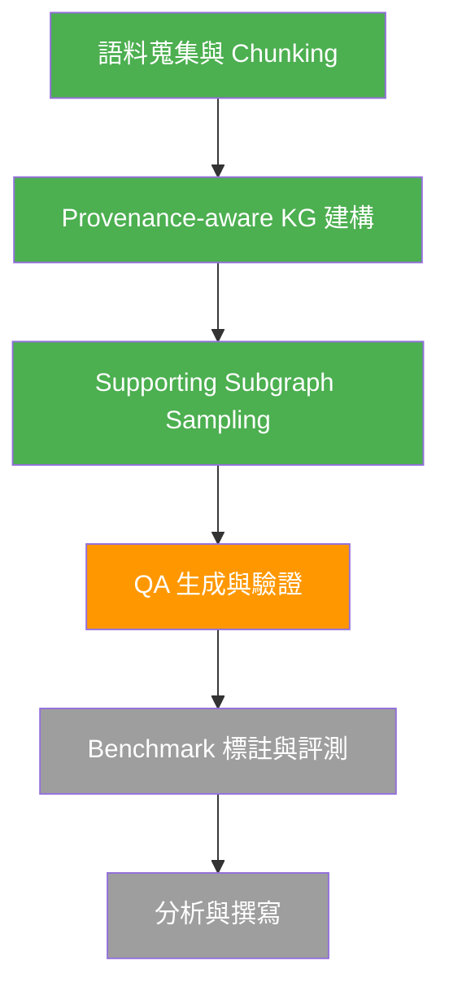
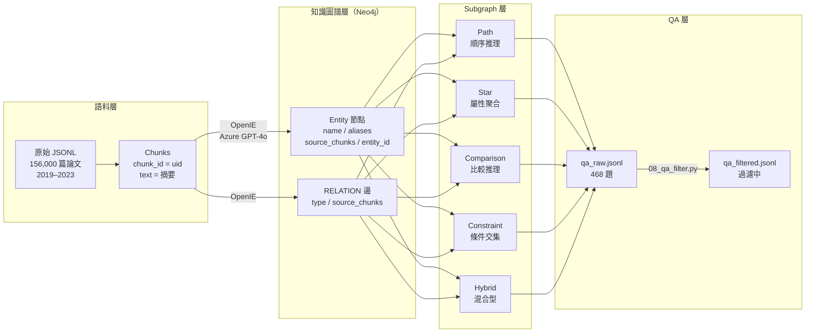
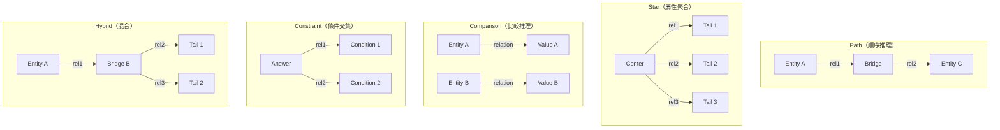
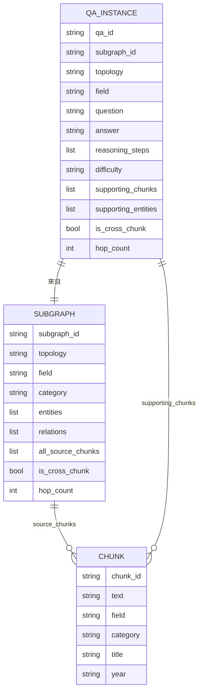

# 研究進度報告

**題目：以知識圖譜為基礎之 Multi-hop 問答 Benchmark 建構，用於評估現有 RAG 方法的跨片段檢索、證據整合與推理能力**

**資料來源：** 臺灣博碩士論文知識加值系統（NDLTD）2019–2023
**目前進度：** 第4階段進行中（QA 生成與驗證） 

---

## 整體架構流程



> 🟢 已完成　🟠 進行中　⚪ 待執行

---

## 研究架構圖



---

## Supporting Subgraph 類型說明



---

## QA Instance 標註結構



---

## 各階段詳細進度

### ✅ 第1階段：語料蒐集與 Chunking

| 項目         | 內容                                                                            |
| ---------- | ----------------------------------------------------------------------------- |
| 語料來源       | 臺灣博碩士論文知識加值系統（NDLTD）                                                          |
| 時間範圍       | 2019–2023 五年份                                                                 |
| 總論文數       | 約 156,000 篇                                                                   |
| 目前處理       | 約 28,407 篇（先以108年進行嘗試）                                                        |
| Chunk 單位   | 每篇論文摘要 = 1 chunk，chunk_id = uid                                               |
| Chunk 欄位   | chunk_id、text、title、field、category、school、year、degree、author、advisor、keywords |
| 學門覆蓋       | 27 個學門，93 個學類                                                                 |

- `text` 優先使用中文摘要，若空則用英文摘要
- Metadata 欄位（作者、學校等）保留於 chunk metadata，不進入 chunk text
- Structured metadata 作為 KG entity attribute 的補充來源

---

### ✅ 第2階段：Provenance-aware KG 建構

#### OpenIE 抽取

| 項目          |                                    |
| ----------- | ---------------------------------- |
| 使用模型        | OpenAI GPT-4o                      |
| 處理篇數        | 28,407 篇                           |
| 成功率         | 99.9%（29 筆失敗，content filter 或特殊字元） |
| 總 triple 數  | 356,838 條                          |
| 平均 triple/篇 | 15.66 個                            |
| 執行時間        | 約 33 秒（max_concurrent=200）         |

**Prompt 設計重點：**

- 過濾 meta-reference head（本研究、研究者、第N章等）
- 限制 head/tail 長度 ≤ 15 字
- 要求 relation 具體，避免「包含」「是」等籠統詞

#### Entity Canonicalization

| 項目                   | 內容                                |
| -------------------- | --------------------------------- |
| Embedding 模型         | BAAI/bge-m3（多語言，繁體中文優化）           |
| 合併方法                 | Embedding similarity + Union-Find |
| Similarity threshold | 0.92                              |
| ANN 搜尋               | FAISS（IndexFlatIP）                |

#### KG 建構結果（Neo4j）

|項目|數值|
|---|---|
|Entity 節點|376,674 個|
|RELATION 邊|355,263 條|
|最高度數 entity|滿意度（2,088 度）、使用意圖（1,092 度）|
|Cross-chunk relations|1,379 條（同一關係出現在 2+ chunk）|
|Cross-chunk 2-hop paths|2,095,600 條|

**Node 屬性：** `name`, `aliases`, `source_chunks`, `entity_id`

**Edge 屬性：** `type`, `source_chunks`

---

### ✅ 第3階段：Supporting Subgraph Sampling

#### 學門分布（Pilot 28,407 篇）

|學門|Chunk 數|佔比|
|---|---|---|
|工程學門|7,134|25.1%|
|商業及管理學門|5,205|18.3%|
|教育學門|3,748|13.2%|
|社會及行為科學學門|868|3.1%|
|醫藥衛生學門|754|2.7%|
|藝術學門|689|2.4%|
|其他 18 學門|各 < 600|—|

#### Subgraph Sampling 結果

|Topology|目標比例|實際數量|
|---|---|---|
|Path|30%|186（43%）|
|Star|25%|85（19%）|
|Comparison|20%|45（10%）|
|Constraint|20%|115（26%）|
|Hybrid|5%|37（8%）|
|**合計**|—|**468**|

**Comparison 偏低原因：** 同 relation type 且跨 chunk 的 pair 在 **單一年度** 資料中較少，可能在總共五年份的資料裡可以解決此情況。

**過濾規則：**

- 強制 cross-chunk（排除 all_source_chunks 只有 1 個的）
- 排除 entity name 超過 20 字的
- Hub bridge entity 門檻：在 bridge 位置出現 > 15 次則標記

---

### 🟠 第4階段：QA 生成與驗證（進行中）

#### QA 生成結果（Script 07）

| 項目    | 數值                              |
| ----- | ------------------------------ |
| 總生成題數 | 468                             |
| 成功率   | 1                               |
| 使用模 OpenAI GPT-4o（temperature=0.7） 0.7） |
| 執行時間  | 約                               |

#### 品質過濾（Script 08）— 持續調整中

**過濾規則演進記錄：**

|版本|問題|調整|
|---|---|---|
|v1|has_shortcut 誤判 constraint topology|移除 LLM has_shortcut 判斷|
|v2|Rule 6（answer in chunk）移除 209 題，邏輯根本有誤|重新設計 Rule 6|
|v3（進行中）|新 Rule 6：single chunk sufficiency（同時包含答案+2個條件詞）|—|

**目前最新過濾統計（v2）：**

|規則|移除題數|
|---|---|
|answer_too_short|1|
|answer_in_question|32|
|hub_bridge_entity|85|
|answer_in_single_chunk（已廢除）|209|
|low_coherence（LLM）|35|
|no_multihop（LLM）|1|
|**最終保留**|**105（22.4%）**|

> ⚠️ 保留率偏低（目標 60–80%），Rule 6 正在重新設計中。

---
## 待解決問題

1. **QA 過濾保留率偏低（22.4%）**：Rule 重新設計中
2. **Difficulty 分布全為 medium**：需要調整 LLM prompt 的難度判斷標準
3. **Comparison topology 數量偏少（45 題）**：需要等全部測試完後看完整資料的表現
4. **還未定義詳細評估標準：** 針對建立的圖（Graph）以及 Benchmark 尚未有詳細的評估指標，還只有初步透過LLM評估。

---

## 檔案結構

```
project/
├── data/
│   ├── raw/                    # 原始 JSONL（28,407 篇 pilot）
│   ├── chunks/
│   │   └── chunks.jsonl        # 28,407 chunks
│   └── kg/
│       ├── triples_raw.jsonl   # 356,838 triples
│       ├── entities.jsonl      # Canonical entities
│       ├── entity_canonical_map.json
│       ├── entity_embeddings.npy
│       ├── chunk_metadata_index.json
│       ├── subgraphs.jsonl     # 468 subgraphs
│       ├── qa_raw.jsonl        # 468 QA instances
│       ├── qa_filtered.jsonl   # 過濾中
│       └── checkpoints/
├── scripts/
│   ├── 01_prepare_chunks.py
│   ├── 02_openie_extract.py
│   ├── 03_canonicalize.py
│   ├── 04_build_kg.py
│   ├── 05_build_chunk_metadata_index.py
│   ├── 06_subgraph_sampling.py
│   ├── 07_qa_generation.py
│   └── 08_qa_filter.py
├── prompts/
│   └── openie_prompt.txt
├── config/
│   └── config.yaml
└── logs/
```

---

## 參考文獻

- HippoRAG v1：Provenance-aware KG 建構方法參考
- MuSiQue：Benchmark 設計規模與品質標準參考
- BAAI/bge-m3：多語言 Embedding 模型