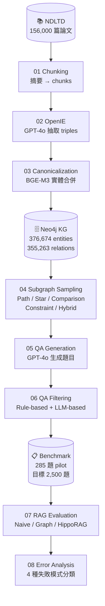
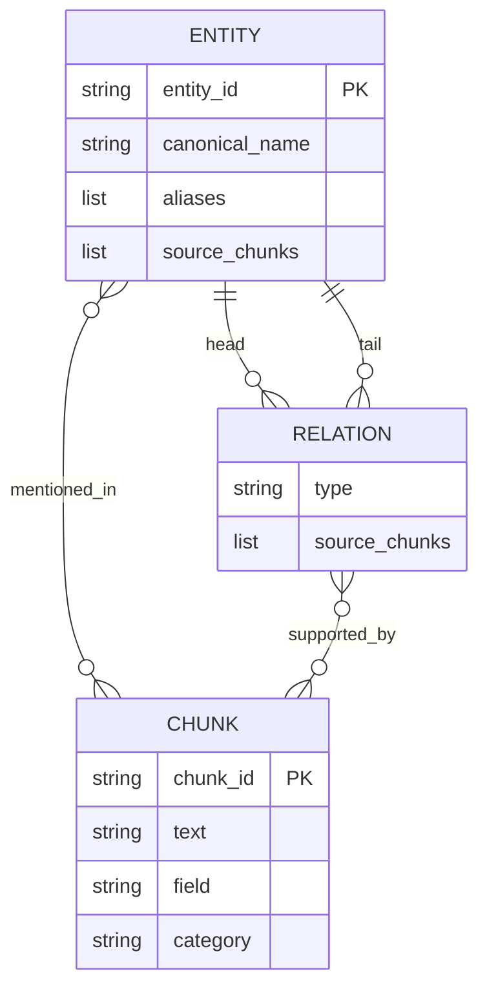
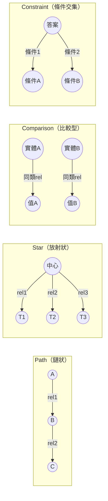
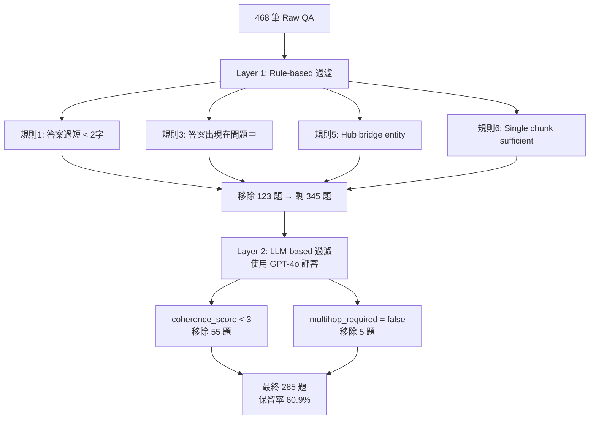
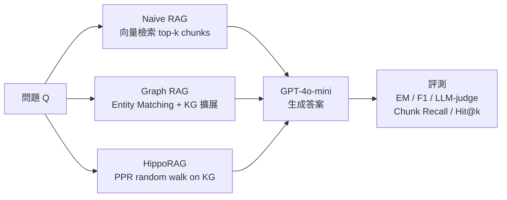
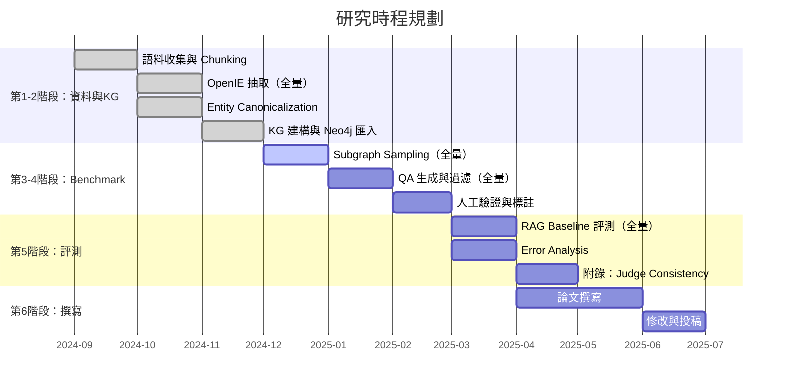
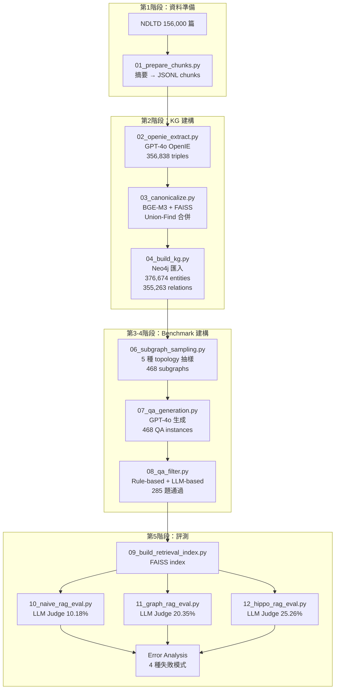
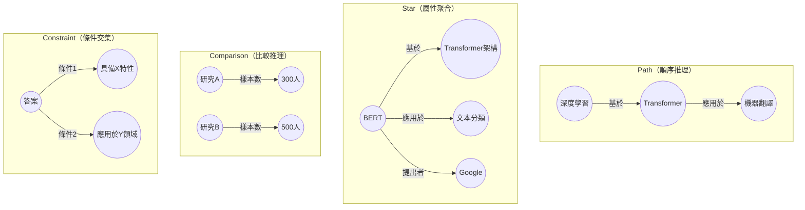
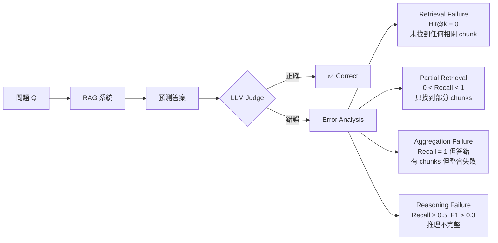

# 以知識圖譜為基礎之 Multi-hop 問答 Benchmark 建構

**用於評估現有 Retrieval-Augmented Generation 方法的跨片段檢索、證據整合與推理能力**

> **A Knowledge-Graph-Grounded Benchmark for Evaluating Cross-Chunk Retrieval, Evidence Composition, and Multi-hop Reasoning in Retrieval-Augmented Generation**

---

|項目|內容|
|---|---|
|資料來源|臺灣博碩士論文知識加值系統（NDLTD），2019–2023|
|論文規模|156,000 篇（24 學門、93 學類）|
|Pilot Benchmark|285 題（5 種 Topology、3 種難度）|
|評測 Baseline|Naive RAG、Graph RAG、HippoRAG|

---

## 目錄

1. [研究背景與動機](https://claude.ai/chat/2e790b92-61db-4476-832b-744fc783c31a#%E4%B8%80%E7%A0%94%E7%A9%B6%E8%83%8C%E6%99%AF%E8%88%87%E5%8B%95%E6%A9%9F)
2. [研究問題](https://claude.ai/chat/2e790b92-61db-4476-832b-744fc783c31a#%E4%BA%8C%E7%A0%94%E7%A9%B6%E5%95%8F%E9%A1%8C)
3. [研究目標](https://claude.ai/chat/2e790b92-61db-4476-832b-744fc783c31a#%E4%B8%89%E7%A0%94%E7%A9%B6%E7%9B%AE%E6%A8%99)
4. [核心命題與假設](https://claude.ai/chat/2e790b92-61db-4476-832b-744fc783c31a#%E5%9B%9B%E6%A0%B8%E5%BF%83%E5%91%BD%E9%A1%8C%E8%88%87%E5%81%87%E8%A8%AD)
5. [資料來源](https://claude.ai/chat/2e790b92-61db-4476-832b-744fc783c31a#%E4%BA%94%E8%B3%87%E6%96%99%E4%BE%86%E6%BA%90)
6. [系統架構與研究方法](https://claude.ai/chat/2e790b92-61db-4476-832b-744fc783c31a#%E5%85%AD%E7%B3%BB%E7%B5%B1%E6%9E%B6%E6%A7%8B%E8%88%87%E7%A0%94%E7%A9%B6%E6%96%B9%E6%B3%95)
7. [知識圖譜建構](https://claude.ai/chat/2e790b92-61db-4476-832b-744fc783c31a#%E4%B8%83%E7%9F%A5%E8%AD%98%E5%9C%96%E8%AD%9C%E5%BB%BA%E6%A7%8B)
8. [Supporting Subgraph Sampling](https://claude.ai/chat/2e790b92-61db-4476-832b-744fc783c31a#%E5%85%ABsupporting-subgraph-sampling)
9. [QA 生成與驗證](https://claude.ai/chat/2e790b92-61db-4476-832b-744fc783c31a#%E4%B9%9Dqa-%E7%94%9F%E6%88%90%E8%88%87%E9%A9%97%E8%AD%89)
10. [Benchmark 標註設計](https://claude.ai/chat/2e790b92-61db-4476-832b-744fc783c31a#%E5%8D%81benchmark-%E6%A8%99%E8%A8%BB%E8%A8%AD%E8%A8%88)
11. [評測設計與 Baseline](https://claude.ai/chat/2e790b92-61db-4476-832b-744fc783c31a#%E5%8D%81%E4%B8%80%E8%A9%95%E6%B8%AC%E8%A8%AD%E8%A8%88%E8%88%87-baseline)
12. [Pilot 實驗結果](https://claude.ai/chat/2e790b92-61db-4476-832b-744fc783c31a#%E5%8D%81%E4%BA%8Cpilot-%E5%AF%A6%E9%A9%97%E7%B5%90%E6%9E%9C)
13. [預期貢獻](https://claude.ai/chat/2e790b92-61db-4476-832b-744fc783c31a#%E5%8D%81%E4%B8%89%E9%A0%90%E6%9C%9F%E8%B2%A2%E7%8D%BB)
14. [研究時程](https://claude.ai/chat/2e790b92-61db-4476-832b-744fc783c31a#%E5%8D%81%E5%9B%9B%E7%A0%94%E7%A9%B6%E6%99%82%E7%A8%8B)
15. [附錄：系統流程圖](https://claude.ai/chat/2e790b92-61db-4476-832b-744fc783c31a#%E9%99%84%E9%8C%84%E7%B3%BB%E7%B5%B1%E6%B5%81%E7%A8%8B%E5%9C%96)

---

## 一、研究背景與動機

Retrieval-Augmented Generation（RAG）已成為大型語言模型處理知識密集型任務的重要方法。其核心概念是先從外部知識來源中檢索相關內容，再將檢索結果作為上下文提供給語言模型生成答案。相較於僅依賴模型參數記憶的方式，RAG 能更有效利用外部知識，並在許多問答與知識密集型任務上展現優勢。

然而，現有 RAG 方法在面對 **multi-hop question answering** 任務時，仍存在明顯限制。這類問題往往無法透過單一片段直接回答，而需要系統從多個分散的證據片段中定位相關資訊、建立關聯、追蹤中介實體，並整合多段 supporting facts 才能產生正確答案。當關鍵證據分布於不同 chunks、不同段落或不同文件時，現有 RAG 方法常出現以下問題：

- 無法完整找回所有必要 supporting evidence
- 無法有效追蹤 bridge entities 或中介關係
- 對高 lexical overlap 的干擾資訊敏感
- 即使檢索到部分相關內容，也未必能正確組合成完整推理依據
- 在涉及比較、條件交集、分支聚合等較複雜的 evidence structure 時，容易發生 evidence aggregation failure

現有 benchmark 雖可評估最終答案是否正確，但往往只提供 QA pair，缺乏與 supporting evidence、reasoning structure、source chunks 的精確對齊。因此，研究者通常只能觀察系統「答對或答錯」，卻難以進一步分析錯誤究竟來自檢索缺漏、證據路徑中斷、聚合失敗，或生成推理錯誤。

基於此，本研究擬建立一套**以知識圖譜為基礎、具備 provenance-aware annotation 的 multi-hop QA benchmark**，並以臺灣博碩士論文（NDLTD）作為語料來源，涵蓋 24 個學門、5 種 evidence topology，系統性評估現有 RAG 方法的能力邊界與失敗模式。

---

## 二、研究問題

**RQ1**：現有 RAG 方法在 one-hop 與 multi-hop QA 任務中，是否存在明顯能力落差？

**RQ2**：當 supporting evidence 分散於不同 chunks 或不同 documents 時，RAG 方法的表現會受到何種程度的影響？

**RQ3**：現有 RAG 方法是否能有效處理不同 evidence topology，例如 path、star、comparison 與 constraint 型 supporting subgraphs？

**RQ4**：當問題需要 bridge entity tracing、branch aggregation、comparison 或多條件交集時，現有 RAG 方法的失敗模式為何？

**RQ5**：不同類型的 RAG 方法（chunk-based、graph-based、PPR-based）是否呈現不同的能力邊界與錯誤型態？

---

## 三、研究目標

1. 建立一套以 **knowledge graph** 為基礎的 multi-hop QA benchmark 建構流程
2. 將 supporting evidence 一般化為 **supporting subgraph**（不限於線性 path），涵蓋 path、star、comparison、constraint、hybrid 五種 topology
3. 為每個 QA instance 建立完整的 provenance-aware annotation，包括 supporting triples、supporting subgraph、source chunks、bridge entities 與 challenge types
4. 系統性評估現有 RAG 方法在 cross-chunk retrieval、bridge entity tracing、attribute aggregation、comparison reasoning 與 constraint satisfaction 等能力上的表現差異
5. 提供一個能同時分析 answer correctness、retrieval completeness 與 subgraph-level failure 的診斷型 benchmark

---

## 四、核心命題與假設

**命題一**：現有 RAG 方法在 one-hop 與 multi-hop QA 上存在顯著能力落差（已由 Pilot 實驗中 Naive RAG 10.18% LLM Judge Accuracy 初步驗證）

**命題二**：Supporting evidence 分散程度會顯著影響 RAG 表現（Pilot 實驗：53.5% 的錯誤來自 retrieval failure，顯示 cross-chunk 問題對 flat vector search 構成根本挑戰）

**命題三**：不同 evidence topology 對 RAG 的難度並不相同（Pilot 實驗：comparison 和 constraint 在 graph-based 方法上進步最顯著，path topology 對所有方法依然最困難）

**命題四**：高 lexical overlap 的 distractors 會干擾 supporting evidence 的定位與整合

**命題五**：不同 RAG 架構具有不同失敗模式，且最佳的圖遍歷深度因 topology 而異（Pilot 實驗：Graph RAG hop=1 整體優於 hop=2，但 star topology 例外需要 hop=2）

---

## 五、資料來源

### 5.1 語料說明

本研究使用**臺灣博碩士論文知識加值系統（NDLTD）**作為語料來源，選擇此資料集的理由如下：

- 覆蓋廣泛：涵蓋 24 學門、93 學類，代表台灣學術研究的完整樣貌
- 結構完整：每筆資料包含論文名稱、摘要（中英文）、學門學類、關鍵詞等結構化欄位
- 規模適中：2019–2023 年共約 156,000 篇，足以建立具代表性的 benchmark
- 語言特性：以繁體中文為主，適合測試多語言 embedding 模型（BGE-M3）的效果

### 5.2 資料規模

|年份範圍|總篇數|有效摘要篇數|學門數|學類數|
|---|---|---|---|---|
|2019–2023|~156,000|~155,938|24|93|

### 5.3 Chunking 策略

每篇論文以**摘要**作為一個 chunk，設計理由如下：

- 摘要包含論文的核心研究概念、方法與結論，語意完整
- 每篇摘要平均 300 tokens，長度適中，適合作為 RAG 的檢索單位
- 結構化 metadata（作者、學門、指導教授等）直接作為 KG 的 entity attributes，不進入 chunk

```
chunk 格式：
{
  "chunk_id": "uid",           // 直接使用論文 uid
  "text": "摘要內容",
  "metadata": {
    "title": "論文名稱",
    "field": "學門",
    "category": "學類",
    "school": "學校名稱",
    "year": "畢業學年度",
    "advisor": "指導教授",
    "keywords_zh": "中文關鍵詞"
  }
}
```

---

## 六、系統架構與研究方法

### 6.1 整體 Pipeline



### 6.2 技術選型說明

|元件|選用技術|選用理由|
|---|---|---|
|OpenIE 抽取|GPT-4o|高準確率，支援繁中學術文本|
|Entity Embedding|BGE-M3|繁中優化，支援中英跨語言匹配|
|KG 儲存|Neo4j|支援 Cypher 查詢，適合 subgraph sampling|
|RAG 生成|GPT-4o-mini|隔離生成能力影響，降低評測成本|
|LLM-as-judge|GPT-4o|評審能力高於被評模型|
|向量檢索|FAISS + BGE-M3|高效 cosine similarity 搜尋|

---

## 七、知識圖譜建構

### 7.1 OpenIE 抽取

本研究採用 **HippoRAG v1** 的 OpenIE 方法對每篇摘要進行 triple 抽取，並針對學術摘要的特性設計以下 prompt 規則：

- head 和 tail 只能是名詞或名詞短語，長度不超過 15 個字
- 排除 meta-reference 類 head（「本研究」、「本論文」等），只保留有語意價值的知識節點
- relation 使用具體動詞短語，避免「包含」、「是」等過於籠統的關係
- 優先抽取具有跨論文連結價值的實體（理論名稱、技術方法、領域概念）

**Pilot 抽取結果（28,407 篇）：**

|指標|數值|
|---|---|
|成功率|99.9%（29 筆因 content filter 失敗）|
|總 triple 數|356,838|
|平均 triple / 篇|12.6|

### 7.2 Provenance-aware KG 設計

KG 中每個節點與邊都保留 source_chunks 屬性，確保每個知識單元可追溯至原始文本：



### 7.3 Entity Canonicalization

使用 **BGE-M3** 對所有 entity 做 embedding，再用 FAISS ANN + Union-Find 合併語意相近的 entity：

- Cosine similarity threshold：0.92
- 字數比例限制：len(a) / len(b) 需在 0.5–2.0 之間（避免短字串誤合併）
- Canonical name 選擇規則：優先選中文、其次選最短字串

**Pilot 結果（28,407 篇）：**

|指標|數值|
|---|---|
|Entity 節點數|376,674|
|Relation 邊數|355,263|
|最高度數節點|滿意度（2,088 條邊）|
|Cross-chunk relations|1,379（同一 relation 出現於多篇論文）|
|2-hop cross-chunk paths|2,095,600|

---

## 八、Supporting Subgraph Sampling

### 8.1 為何從 Path 擴展到 Subgraph

傳統 multi-hop benchmark 多使用線性 path 生成題目，只能測試 sequential reasoning。本研究進一步將 supporting evidence 一般化為 **supporting subgraph**，以涵蓋更真實的推理結構：



### 8.2 五種 Topology 定義

|Topology|結構描述|測試能力|出題範例|
|---|---|---|---|
|**Path**|A → B → C 線性鏈|Sequential reasoning、Bridge entity tracing|「X 方法基於的理論最早由誰提出？」|
|**Star**|中心 entity 連出多個屬性|Attribute aggregation、Branch selection|「同時具備 A、B、C 特性的是什麼方法？」|
|**Comparison**|兩個 entity 透過相同 relation 取值比較|Dual-branch retrieval、Comparative reasoning|「A 研究與 B 研究在樣本數上有何差異？」|
|**Constraint**|答案同時滿足兩個來自不同 chunk 的條件|Condition satisfaction、Multi-branch filtering|「哪種技術同時具備 X 特性且應用於 Y 領域？」|
|**Hybrid**|Path + Star 的組合|綜合推理能力|複合型問題|

### 8.3 抽樣規則與品質控制

**必要條件（強制 cross-chunk）：**

- all_source_chunks 至少包含 2 個不同 chunk_id
- 各 relation 的 source_chunks 不能完全相同

**過濾條件：**

- 排除 hub node 作為 bridge entity（出現超過 15 次的 entity）
- 排除 entity name 超過 20 字的 subgraph

**Pilot Sampling 結果（28,407 篇）：**

|Topology|數量|比例|
|---|---|---|
|Path|186|40%|
|Constraint|115|25%|
|Star|85|18%|
|Comparison|45|10%|
|Hybrid|37|8%|
|**合計**|**468**|**100%**|

---

## 九、QA 生成與驗證

### 9.1 生成流程

使用 GPT-4o 根據 supporting subgraph 與對應的原始摘要文字生成 QA instances。每種 topology 設計專屬 prompt 模板，確保：

- 問題自然且語意清楚
- 問題需依賴指定 supporting subgraph 才能作答
- 不直接暴露中介節點或圖結構
- 避免 lexical shortcut（問題中的線索直接暴露答案）

### 9.2 驗證機制（兩層過濾）



### 9.3 Shortcut 偵測機制

本研究採用**客觀指標**替代 LLM 主觀判斷來偵測 shortcut，避免對 constraint topology 的系統性誤判：

**Rule 6（Single chunk sufficiency）：** 若存在某個 supporting chunk，其文字同時包含答案字串 AND 至少 2 個問題關鍵條件詞，則判定為 shortcut

豁免規則：

- comparison topology 完全豁免（設計上兩個 chunk 各提供一個值）
- supporting_chunks ≥ 3 的題目豁免

---

## 十、Benchmark 標註設計

### 10.1 三層標註架構

```
QA Instance
├── qa_id / question / answer
├── topology（path / star / comparison / constraint / hybrid）
├── difficulty（easy / medium / hard）
├── hop_count（1 / 2 / 3）
├── supporting_triples（KG triple list）
├── supporting_chunks（ground truth chunk_ids）
├── supporting_subgraph（完整子圖結構）
├── bridge_entities / central_entities
└── challenge_type（cross_chunk / bridge_entity / comparison / constraint / ...）
```

### 10.2 Difficulty 分級標準

|難度|定義|Pilot 分布|
|---|---|---|
|Easy|hop_count = 1，reasoning_steps ≤ 2|17 題（6.0%）|
|Medium|需整合 2 個來源，推理步驟 2 步|163 題（57.2%）|
|Hard|comparison topology、supporting_chunks ≥ 3、或 reasoning_steps ≥ 4|105 題（36.8%）|

### 10.3 Pilot Benchmark 統計

**各 Topology 分布：**

|Topology|題數|比例|
|---|---|---|
|Constraint|106|37.2%|
|Path|75|26.3%|
|Star|68|23.9%|
|Comparison|24|8.4%|
|Hybrid|12|4.2%|
|**合計**|**285**|**100%**|

---

## 十一、評測設計與 Baseline

### 11.1 三種 RAG Baseline



**Naive RAG：** BGE-M3 向量化所有 chunks → FAISS 檢索 top-5 → GPT-4o-mini 生成答案

**Graph RAG：** 從問題字串匹配 KG entity → 1-hop subgraph 擴展 → BGE-M3 reranking → 取 top-5 chunks → GPT-4o-mini 生成答案

**HippoRAG：** 字串匹配 seed entities → 3-hop 局部子圖 → Personalized PageRank（α=0.85） → top-50 entities 的 source_chunks → BGE-M3 reranking → top-5 chunks → GPT-4o-mini 生成答案

### 11.2 Data-Judge Separation 設計

|用途|模型|理由|
|---|---|---|
|OpenIE 抽取（建 KG）|GPT-4o|需要高準確率|
|QA 生成|GPT-4o|需要高品質題目|
|QA 過濾（LLM judge）|GPT-4o|與生成模型一致|
|**RAG 生成答案**|**GPT-4o-mini**|隔離生成能力，降低成本|
|**LLM-as-judge（評分）**|**GPT-4o**|評審能力高於被評模型|
|**附錄 Judge Consistency**|**Gemini Pro**|驗證評測結果的跨模型穩定性|

### 11.3 評測指標設計

**Answer-level：**

- Exact Match（EM）
- Token F1
- LLM-as-judge Accuracy（GPT-4o 語意等價判斷）

**Retrieval-level：**

- Supporting Chunk Recall = |retrieved ∩ ground_truth| / |ground_truth|
- Supporting Chunk Precision = |retrieved ∩ ground_truth| / |retrieved|
- Hit@k = 1 if any ground truth chunk in top-k

**Error Analysis（4 種失敗模式）：**

|錯誤類型|定義|
|---|---|
|Retrieval Failure|Hit@k = 0，完全沒找到任何 ground truth chunk|
|Partial Retrieval|0 < Chunk Recall < 1.0，只找到部分 ground truth chunk|
|Aggregation Failure|Chunk Recall = 1.0 但答案仍錯，找到所有 chunk 但整合失敗|
|Reasoning Failure|Chunk Recall ≥ 0.5 且 F1 > 0.3，有相關資訊但推理不完整|

---

## 十二、Pilot 實驗結果

> **注意：以下為 28,407 篇（約一年份）資料的 Pilot 實驗結果，全量實驗結果待補。**

### 12.1 三方整體對比

|指標|Naive RAG|Graph RAG|HippoRAG|
|---|---|---|---|
|**LLM Judge Accuracy**|10.18%|20.35%|**25.26%**|
|**Exact Match**|3.16%|7.72%|**8.42%**|
|**Token F1**|3.98%|9.52%|**11.53%**|
|**Hit@k**|50.18%|65.26%|**65.26%**|
|**Chunk Recall**|24.25%|34.28%|**34.87%**|
|**Chunk Precision**|11.02%|15.37%|**15.65%**|

**相對 Naive RAG 提升：**

|方法|LLM Judge|Hit@k|Chunk Recall|
|---|---|---|---|
|Graph RAG|+10.17%|+15.08%|+10.03%|
|HippoRAG|**+15.08%**|**+15.08%**|**+10.62%**|

### 12.2 按 Topology 分析（LLM Judge Accuracy）

|Topology|Naive RAG|Graph RAG|HippoRAG|最大挑戰|
|---|---|---|---|---|
|Path|5.3%|8.0%|6.7%|Bridge entity tracing|
|Star|13.2%|13.2%|—|Attribute aggregation|
|Comparison|4.2%|29.2%|—|Dual-branch retrieval|
|Constraint|13.2%|31.1%|**37.7%**|Multi-condition filtering|
|Hybrid|—|25.0%|—|Combined reasoning|

### 12.3 Error Analysis

**Naive RAG 失敗分布：**

```
Retrieval Failure    ████████████████████████  53.5%  (137 題)
Partial Retrieval    ████████████████          34.5%  ( 88 題)
Aggregation Failure  ████                       8.2%  ( 21 題)
Reasoning Failure    ██                         3.9%  ( 10 題)
```

**Graph RAG 失敗分布（hop=1）：**

```
Partial Retrieval    ████████████████████████  47.8%  (122 題)
Retrieval Failure    ████████████████          31.4%  ( 80 題)
Aggregation Failure  ████████                  14.9%  ( 38 題)
Reasoning Failure    ████                       5.9%  ( 15 題)
```

> Graph RAG 最大貢獻：Retrieval Failure 從 53.5% 降至 31.4%（-22.1%），代表 KG 有效補足了向量檢索的盲點。

### 12.4 Ablation Study：Graph RAG Hop Depth

|指標|hop=1|hop=2|備註|
|---|---|---|---|
|LLM Judge|**20.35%**|16.14%|hop=1 整體更好|
|Avg Subgraph Size|**87.1**|99.8|hop=1 噪音更少|
|Star topology Judge|13.24%|**17.65%**|Star 例外需要 hop=2|

**發現：** 最佳 hop depth 因 topology 而異。Star topology 需要從中心 entity 出發到葉節點，需要 2-hop；但 path、comparison、constraint、hybrid 在 1-hop 下表現更好，因為 2-hop 引入過多噪音。

---

## 十三、預期貢獻

**貢獻一：提出完整的 provenance-aware multi-hop QA benchmark 建構流程**

從語料收集、KG 建構、subgraph sampling 到 QA 生成與驗證，建立一套可重現、可擴展的 pipeline。

**貢獻二：將 supporting structure 從 path 擴展為 supporting subgraph**

涵蓋 path、star、comparison、constraint、hybrid 五種 topology，使 benchmark 能反映更真實的 evidence organization。

**貢獻三：建立診斷型 benchmark，支援多層次錯誤分析**

同時提供 answer-level、retrieval-level 與 subgraph-level 分析，能區分 retrieval failure、aggregation failure 與 reasoning failure。

**貢獻四：揭示不同 RAG 方法的能力邊界與失敗模式**

Pilot 實驗發現：graph-based 方法在 comparison 和 constraint 題型上優勢明顯，但 path topology 對所有方法依然是共同瓶頸；最佳圖遍歷深度因 topology 而異。

**貢獻五：提供繁體中文學術領域的多跳問答測試平台**

以台灣博碩士論文為語料，覆蓋 24 學門，為中文 RAG 評測提供一個具代表性的 benchmark。

---

## 十四、研究時程



### 各階段里程碑

|階段|里程碑|狀態|
|---|---|---|
|第1階段|語料收集、Chunking 完成（28,407 篇 pilot）|✅ 完成|
|第2階段|KG 建構完成，provenance 驗證通過|✅ 完成（Pilot）|
|第3階段|Subgraph sampling，468 個 pilot subgraphs|✅ 完成（Pilot）|
|第4階段|QA 生成與驗證，285 題 pilot benchmark|✅ 完成（Pilot）|
|第5階段|三種 RAG baseline 評測完成|✅ 完成（Pilot）|
|全量擴展|156,000 篇全量 KG 建構|🔄 待執行|
|全量 Benchmark|目標 2,500 題|🔄 待執行|
|論文撰寫|完整實驗結果與分析|📝 進行中|

---

## 附錄：系統流程圖

### A. 完整 Pipeline 架構



### B. Supporting Subgraph 類型



### C. Error Analysis 框架



---

_本文件為研究提案報告，實驗結果部分（第十二章）為 Pilot 實驗（28,407 篇）數據，全量實驗結果待補充。_